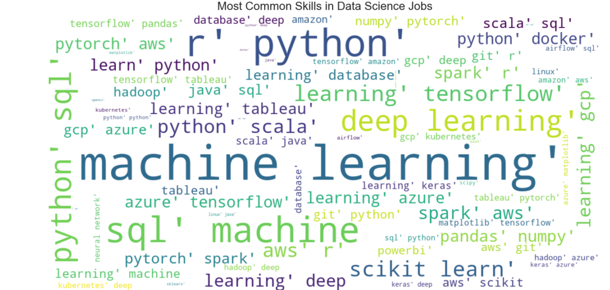

# 📊 Data Science Job Market Analysis (2025)

## 📌 Project Overview
This project analyzes the Data Science hiring funnel and salary trends for the year 2025.

* **📄 Read the Full Report:** [View Project Report (PDF)](Project%20Report%20of%20Data%20Science%20Salary%20Analysis.pdf)
* **💻 View the Code:** [View Jupyter Notebook](Exploratory%20Data%20Analysis%20of%20Hiring%20Funnel%20&%20Salary%20Determinants.ipynb)

---

## 🔍 Visual Analysis

### 1. Job Market Overview
**Distribution of Job Titles & Seniority**

### 2. Location & Salary Trends
**Where are the jobs, and how much do they pay?**

### 3. Deep Dive: Salary vs. Seniority
**Outlier Detection**

### 4. Skills Analysis
**Most In-Demand Keywords**

